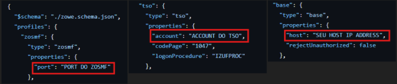
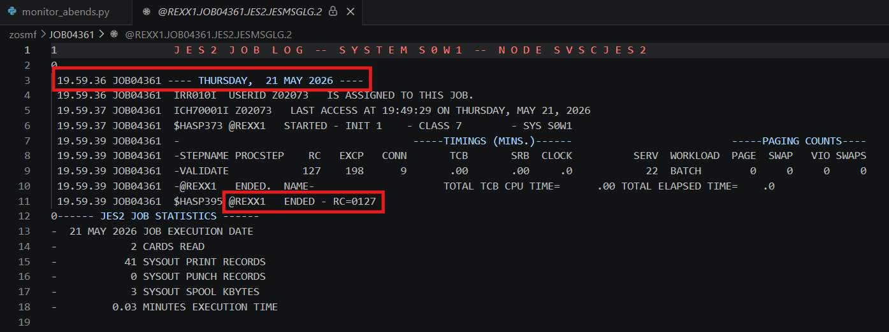
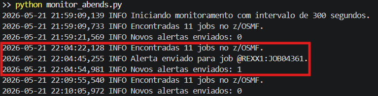
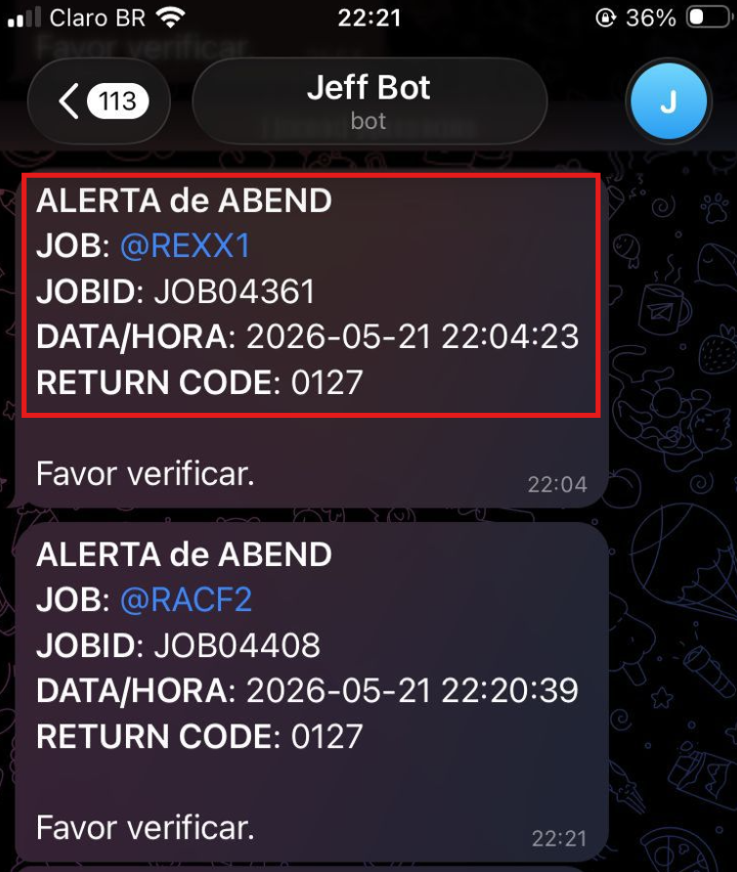

# monitor_abends
Programa escrito em **Python** para monitorar **Mainframe job ABENDs via z/OSMF com a interface do ZOWE no VSCODE** _(extenção IBM Z Open Editor)_. Programa monitora de 5 em 5 minutos e envia alertas para o appl Telegram caso houver abends.

# Requisitos e Configurações:
1) Assim que instalar o ZOWE no VSCODE ele carrega o arquivo `zowe_config.json`, é aqui que inserimos o host, account e a porta do z/OSMF. Configure os campos que estão indicados na imagem abaixo:
   
   

_(Esse arquivo `zowe_config.json` está no repositório caso desejar usa-lo)_

2) Variáveis de ambiente:
  - `ZOWE_USER`
  - `ZOWE_PASSWORD`
  - `TELEGRAM_BOT_TOKEN`
  - `TELEGRAM_CHAT_ID`
    
Utilizei o Powershell para configurar as variáveis juntamente com o comando .py para rodar o programa logo em seguida. Segue abaixo.
_(lembrando que é preciso criar um BOT no BotFather do Telegram para ter o TOKEN e CHAT ID)_

```bash
$env:ZOWE_USER = "seu_usuario"
$env:ZOWE_PASSWORD = "sua_senha"
$env:TELEGRAM_BOT_TOKEN = "seu_token_do_bot"
$env:TELEGRAM_CHAT_ID = "seu_chat_id"

python monitor_abends.py
```

3) Instale dependências:

```bash
python -m pip install -r requirements.txt
```

## Como funciona
 - Na imagem abaixo simulei um Job Abend dentro do ZOWE.
   - `Job: @REXX1`
   - `JOBID: JOB04361`
   - `RC=0127`
   - `THURSDAY, 21 MAY` _Apenas horário do Mainframe que se difere do meu fuso horário_ 
     
   

Na imagem abaixo podemos notar o programa `monitor_abends` em funcionamento! _(com o intervalo de 5min em 5min)_

Note que o programa se conecta ao z/OSMF usando as configurações que colocamos no arquivo `zowe_config.json`. Busca jobs com status `ENDED`, lê o `JOBLOG` de cada job e detecta ABENDs por padrão de texto ou RC.
Em seguida, o programa já indentificou que o **JOB @REXX1 (JOBID JOB04361)** abendou e dessa forma envia o alerta:

 

O alerta é enviado ao BOT no Telegram, assim como na imagem abaixo:

 

_Poderiamos usar outros métodos de alerta, como envio por e-mail que também seria bem prático. Porém, o alerta via Telegram foi escolhido por ser mais simples e fácil de configurar. Ainda assim, nada impede de mudar ou adicionar outras ferramentas para o envio dos alertas._


## Arquivos

- `monitor_abends.py`: script principal.
- `zowe_config.json`: configuração de acesso Zowe.
- `requirements.txt`: dependências.
- `.last_seen_jobs.json`: estado local gerado automaticamente.
